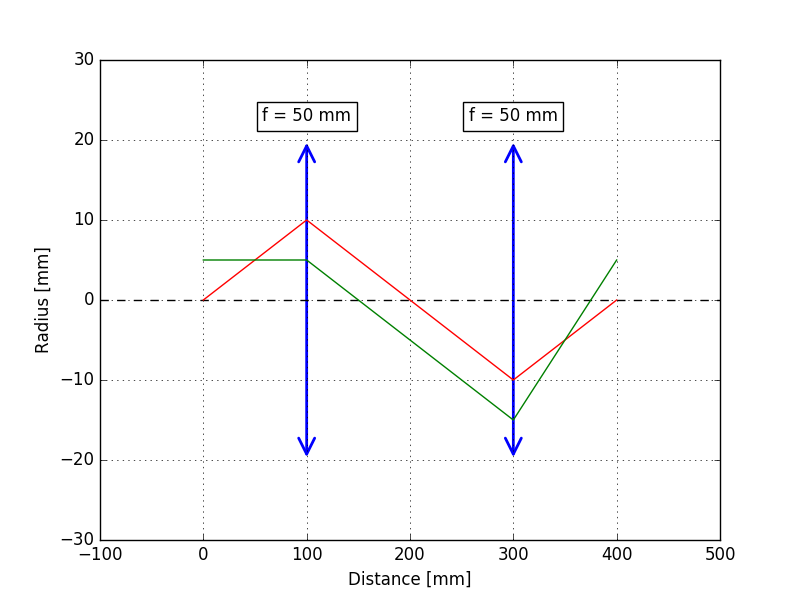

# geometric-optics
A simple Python script for tracing rays through geometric optical elements

# example code
```python
scene = Scene()

scene.add(0, LightRay(0, 0.1))
scene.add(0, LightRay(0.5, 0))
scene.add(0, FreeSpace(10))
scene.add(10, Lens(5))
scene.add(10, FreeSpace(20))
scene.add(30, Lens(5))
scene.add(30, FreeSpace(10))
    
scene.view()
```
